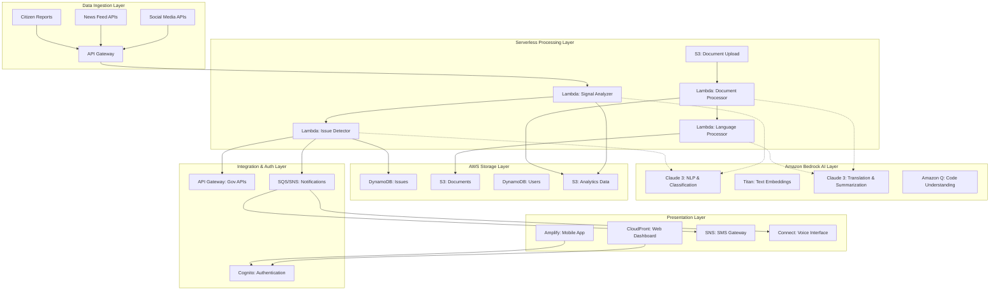

# Design Document: CivicSignal AI+

## Overview

CivicSignal AI+ is designed as a distributed, microservices-based system that leverages natural language processing, machine learning, and real-time data processing to serve Indian communities. The architecture prioritizes scalability, multi-language support, and responsible AI deployment while ensuring seamless integration with existing government infrastructure.

The system operates through two primary workflows: (1) continuous monitoring and analysis of public textual signals to detect civic issues, and (2) on-demand translation and simplification of government documents. Both workflows are designed to handle the linguistic diversity and scale requirements of Indian public systems.

## Architecture

### High-Level Architecture



### Serverless Microservices Architecture

The system is decomposed into the following AWS Lambda-based microservices:

1. **Signal Ingestion Function**: Handles real-time data collection via API Gateway
2. **Issue Detection Function**: Processes textual signals using Amazon Bedrock Claude 3
3. **Document Translation Function**: Manages document processing with Bedrock translation
4. **Language Processing Function**: Provides multi-language NLP via Bedrock models
5. **User Management Function**: Handles authentication through Amazon Cognito
6. **Notification Function**: Manages alerts via SNS and SQS
7. **Analytics Function**: Processes usage data with serverless analytics
8. **Integration Function**: Manages external API connections through API Gateway

## Components and Interfaces

### Signal Ingestion Function

**Purpose**: Collect and normalize textual data from various public sources via API Gateway

**Key Interfaces**:
- `POST /api/v1/signals/ingest` - Accept new textual signals via API Gateway
- `GET /api/v1/signals/sources` - Manage data source configurations
- `POST /api/v1/signals/batch` - Bulk signal processing via SQS

**AWS Components**:
- API Gateway for HTTP endpoints
- Lambda function for processing logic
- SQS for batch processing queues
- CloudWatch for monitoring and logging
- DynamoDB for source configuration storage

### Issue Detection Function

**Purpose**: Analyze textual signals using Amazon Bedrock Claude 3 to identify civic issues

**Key Interfaces**:
- `POST /api/v1/issues/analyze` - Process signals for issue detection
- `GET /api/v1/issues/{id}` - Retrieve issue details from DynamoDB
- `PUT /api/v1/issues/{id}/status` - Update issue status
- `GET /api/v1/issues/search` - Search and filter issues

**AWS Components**:
- Lambda function with Bedrock Claude 3 integration
- DynamoDB for issue storage with GSI for querying
- Amazon Bedrock for AI-powered classification and NLP
- EventBridge for issue status change events
- S3 for storing raw signal data

### Document Translation Function

**Purpose**: Translate and simplify government documents using Amazon Bedrock

**Key Interfaces**:
- `POST /api/v1/documents/upload` - Upload document to S3 for processing
- `GET /api/v1/documents/{id}/translation` - Retrieve translated document
- `POST /api/v1/documents/translate` - Direct text translation via Bedrock
- `GET /api/v1/documents/{id}/simplified` - Get Bedrock-generated simplified explanation

**AWS Components**:
- S3 for document storage with lifecycle policies
- Lambda function with Bedrock Claude 3 for translation
- Textract for document parsing and OCR
- DynamoDB for document metadata
- CloudFront for document delivery

### Language Processing Function

**Purpose**: Provide centralized multi-language NLP using Amazon Bedrock models

**Key Interfaces**:
- `POST /api/v1/nlp/analyze` - General text analysis via Bedrock
- `POST /api/v1/nlp/translate` - Translation services using Bedrock
- `POST /api/v1/nlp/entities` - Named entity recognition with Claude 3
- `POST /api/v1/nlp/sentiment` - Sentiment analysis using Bedrock

**AWS Components**:
- Lambda function integrating multiple Bedrock models
- Amazon Bedrock Claude 3 for advanced NLP tasks
- Amazon Bedrock Titan for text embeddings
- DynamoDB for caching frequent analyses
- CloudWatch for performance monitoring

## Data Models

### Issue Model

```typescript
interface Issue {
  id: string;
  type: IssueType; // WATER, ROAD, SANITATION, POWER, OTHER
  severity: SeverityLevel; // LOW, MEDIUM, HIGH, CRITICAL
  location: GeoLocation;
  description: string;
  originalText: string;
  language: LanguageCode;
  confidence: number; // 0.0 to 1.0
  status: IssueStatus; // DETECTED, VERIFIED, IN_PROGRESS, RESOLVED
  createdAt: Date;
  updatedAt: Date;
  assignedAuthority?: string;
  citizenReports: number;
  relatedIssues: string[];
  metadata: IssueMetadata;
}

interface GeoLocation {
  latitude: number;
  longitude: number;
  address: string;
  administrativeLevel: {
    state: string;
    district: string;
    city: string;
    ward?: string;
  };
  confidence: number;
}

interface IssueMetadata {
  sourceType: string; // SOCIAL_MEDIA, NEWS, CITIZEN_REPORT
  sourceId: string;
  detectionModel: string;
  processingTime: number;
  reviewRequired: boolean;
}
```

### Document Model

```typescript
interface Document {
  id: string;
  originalName: string;
  contentType: string;
  sourceLanguage: LanguageCode;
  targetLanguages: LanguageCode[];
  category: DocumentCategory; // GOVERNMENT, BANKING, LEGAL, OTHER
  uploadedBy: string;
  uploadedAt: Date;
  status: ProcessingStatus; // UPLOADED, PROCESSING, COMPLETED, FAILED
  originalContent: string;
  translations: Translation[];
  simplifications: Simplification[];
  metadata: DocumentMetadata;
}

interface Translation {
  language: LanguageCode;
  content: string;
  confidence: number;
  method: string; // AI_TRANSLATION, HUMAN_VERIFIED
  createdAt: Date;
}

interface Simplification {
  language: LanguageCode;
  simplifiedContent: string;
  keyPoints: string[];
  definitions: TermDefinition[];
  readabilityScore: number;
  createdAt: Date;
}
```

### User Model

```typescript
interface User {
  id: string;
  phoneNumber: string;
  email?: string;
  preferredLanguage: LanguageCode;
  location: GeoLocation;
  accessibilityNeeds: AccessibilityProfile;
  role: UserRole; // CITIZEN, OFFICIAL, ADMIN
  permissions: Permission[];
  createdAt: Date;
  lastActiveAt: Date;
  notificationPreferences: NotificationSettings;
}

interface AccessibilityProfile {
  screenReader: boolean;
  voiceInterface: boolean;
  highContrast: boolean;
  largeFonts: boolean;
  smsOnly: boolean;
  audioDescriptions: boolean;
}
```

### Remaining Service Interfaces

#### User Management Function

**Purpose**: Handle user authentication and profiles through Amazon Cognito

**Key Interfaces**:
- `POST /api/v1/users/register` - Register new user via Cognito
- `POST /api/v1/users/login` - User authentication through Cognito
- `GET /api/v1/users/{id}/profile` - Get user profile from DynamoDB
- `PUT /api/v1/users/{id}/preferences` - Update user preferences
- `POST /api/v1/users/verify` - Verify user identity with Cognito MFA

**AWS Components**:
- Amazon Cognito for user authentication and management
- Lambda function for profile management logic
- DynamoDB for user preferences and extended profile data
- API Gateway with Cognito authorizers
- SES for email notifications

#### Notification Function

**Purpose**: Manage multi-channel notifications using AWS messaging services

**Key Interfaces**:
- `POST /api/v1/notifications/send` - Send notification via SNS
- `GET /api/v1/notifications/{userId}` - Get user notifications from DynamoDB
- `PUT /api/v1/notifications/{id}/read` - Mark as read
- `POST /api/v1/notifications/subscribe` - Subscribe to SNS topics

**AWS Components**:
- Amazon SNS for push notifications and SMS
- Amazon SQS for reliable message queuing
- Lambda function for notification processing
- DynamoDB for notification history
- Amazon Connect for voice notifications
- SES for email notifications

#### Analytics Function

**Purpose**: Process usage data and generate insights using serverless analytics

**Key Interfaces**:
- `GET /api/v1/analytics/issues/trends` - Issue trend analysis from S3 data
- `GET /api/v1/analytics/performance` - CloudWatch metrics aggregation
- `POST /api/v1/analytics/reports/generate` - Generate reports using Bedrock
- `GET /api/v1/analytics/dashboard/{role}` - Role-specific dashboards

**AWS Components**:
- Amazon Kinesis for real-time data streaming
- S3 for data lake storage with partitioning
- AWS Glue for ETL processing
- Amazon Athena for ad-hoc querying
- QuickSight for dashboard visualization
- Lambda for custom analytics processing

#### Integration Function

**Purpose**: Manage external API connections through API Gateway

**Key Interfaces**:
- `POST /api/v1/integrations/government/sync` - Sync with government systems
- `GET /api/v1/integrations/status` - Check integration health via CloudWatch
- `POST /api/v1/integrations/webhook` - Handle external webhooks
- `GET /api/v1/integrations/export/{format}` - Export data from S3

**AWS Components**:
- API Gateway for external API management
- Lambda function for integration logic
- Step Functions for complex workflow orchestration
- S3 for data export and import
- EventBridge for event-driven integrations
- Systems Manager Parameter Store for API configurations

## Technology Stack

### AWS Serverless Backend
- **Compute**: AWS Lambda functions with Node.js 18.x runtime
- **API Management**: Amazon API Gateway with REST and WebSocket APIs
- **Authentication**: Amazon Cognito with MFA and social identity providers
- **Message Queuing**: Amazon SQS for reliable async processing
- **Event Processing**: Amazon EventBridge for event-driven architecture
- **Workflow Orchestration**: AWS Step Functions for complex business logic

### Amazon Bedrock AI/ML Services
- **Primary LLM**: Claude 3 (Sonnet/Haiku) for classification, NLP, and reasoning
- **Translation & Summarization**: Claude 3 for context-aware document processing
- **Text Embeddings**: Amazon Titan Text Embeddings for semantic search
- **Content Generation**: Claude 3 for simplified explanations and summaries
- **Code Understanding**: Amazon Q for development assistance and code analysis
- **Responsible AI**: Built-in guardrails and bias detection in Bedrock models

### AWS Data & Storage Services
- **Primary Database**: Amazon DynamoDB with Global Secondary Indexes
- **Document Storage**: Amazon S3 with intelligent tiering and lifecycle policies
- **Data Lake**: S3 with AWS Glue for ETL and Amazon Athena for querying
- **Search**: Amazon OpenSearch Service for full-text search capabilities
- **Caching**: Amazon ElastiCache (Redis) for session and frequently accessed data
- **Document Processing**: Amazon Textract for OCR and document parsing

### AWS Infrastructure & Operations
- **Content Delivery**: Amazon CloudFront for global content distribution
- **Monitoring**: Amazon CloudWatch with custom metrics and alarms
- **Logging**: CloudWatch Logs with structured logging and retention policies
- **Security**: AWS IAM, AWS KMS for encryption, AWS WAF for web protection
- **Secrets Management**: AWS Secrets Manager for API keys and credentials
- **Infrastructure as Code**: AWS CDK (TypeScript) for resource provisioning

## Security Architecture

### AWS-Native Authentication & Authorization
- **Amazon Cognito**: User pools with MFA (SMS, TOTP, biometric)
- **JWT Integration**: Cognito-issued tokens with API Gateway authorizers
- **Role-Based Access**: Cognito groups mapped to IAM roles (Citizen, Official, Admin)
- **API Security**: API Gateway with throttling, CORS, and request validation
- **Fine-Grained Access**: DynamoDB item-level permissions via IAM policies

### AWS Data Protection Services
- **Encryption**: AWS KMS for key management, S3/DynamoDB encryption at rest
- **Transit Security**: TLS 1.3 enforced via CloudFront and API Gateway
- **PII Detection**: Amazon Comprehend PII detection with automatic redaction
- **Audit Logging**: CloudTrail for API calls, CloudWatch for application logs
- **Compliance**: AWS Config for compliance monitoring and remediation

### AWS Infrastructure Security
- **Network Isolation**: VPC with private subnets for Lambda functions
- **Web Protection**: AWS WAF with managed rule sets and custom rules
- **Secrets Management**: AWS Secrets Manager with automatic rotation
- **Vulnerability Management**: Amazon Inspector for security assessments
- **DDoS Protection**: AWS Shield Advanced for enhanced protection

## Performance Considerations

### AWS Serverless Scalability
- **Auto-Scaling**: Lambda functions scale automatically to handle traffic
- **Concurrent Executions**: Reserved concurrency for critical functions
- **DynamoDB Scaling**: On-demand billing with auto-scaling for predictable workloads
- **API Gateway**: Built-in throttling and caching capabilities
- **Global Distribution**: CloudFront edge locations for low-latency access

### AWS-Optimized Performance Strategies
- **Multi-Level Caching**: CloudFront CDN, API Gateway caching, ElastiCache
- **Database Optimization**: DynamoDB GSI design, connection pooling via RDS Proxy
- **Bedrock Optimization**: Model selection (Haiku for speed, Sonnet for accuracy)
- **Async Processing**: SQS/EventBridge for decoupled, scalable processing
- **Content Optimization**: S3 Transfer Acceleration for global uploads

### AWS Load Management
- **API Gateway**: Built-in load balancing and request routing
- **Lambda Concurrency**: Provisioned concurrency for consistent performance
- **DynamoDB**: Adaptive capacity and global tables for multi-region deployment
- **CloudFront**: Geographic distribution with edge caching
- **Auto-Scaling**: CloudWatch metrics-based scaling for all services

## Deployment Strategy

### AWS Serverless Environment Setup
- **Development**: AWS SAM local with DynamoDB Local and LocalStack
- **Staging**: Full AWS environment with reduced capacity and test data
- **Production**: Multi-region deployment with AWS Global Infrastructure

### AWS-Native CI/CD Pipeline
- **Source Control**: AWS CodeCommit or GitHub with AWS CodeStar connections
- **Build Process**: AWS CodeBuild with automated testing and CDK synthesis
- **Deployment**: AWS CodePipeline with blue-green deployment via CodeDeploy
- **Infrastructure**: AWS CDK (TypeScript) for infrastructure as code
- **Monitoring**: CodePipeline integration with CloudWatch for deployment metrics

### AWS Infrastructure as Code
- **CDK Stacks**: Modular CDK constructs for each microservice
- **Environment Management**: CDK context for environment-specific configurations
- **Resource Tagging**: Consistent tagging strategy for cost allocation and governance
- **Cross-Stack References**: CDK exports/imports for resource sharing
- **Deployment Automation**: CDK Pipelines for self-mutating deployment pipelines

## Error Handling and Monitoring

### AWS-Native Error Management
- **Lambda Error Handling**: Dead letter queues (SQS) for failed function executions
- **API Gateway**: Built-in error responses and custom error handling
- **Step Functions**: Retry logic and error state handling for workflows
- **EventBridge**: Error handling and replay capabilities for event processing
- **DynamoDB**: Conditional writes and optimistic locking for data consistency

### AWS Monitoring and Observability
- **CloudWatch Metrics**: Custom business metrics and AWS service metrics
- **CloudWatch Logs**: Structured logging with log groups and retention policies
- **X-Ray Tracing**: Distributed tracing across Lambda functions and AWS services
- **CloudWatch Alarms**: Proactive alerting for system anomalies and thresholds
- **AWS Health Dashboard**: Service health monitoring and incident notifications

### AWS Performance Monitoring
- **API Gateway Metrics**: Request latency, error rates, and throttling metrics
- **Lambda Insights**: Function performance, memory usage, and cold start analysis
- **DynamoDB Metrics**: Read/write capacity, throttling, and performance insights
- **Bedrock Metrics**: Model invocation metrics, latency, and token usage
- **CloudWatch Synthetics**: Synthetic monitoring for user experience validation

## Correctness Properties

Based on the requirements analysis, the following correctness properties must be validated through property-based testing:

### Property 1: Bedrock Issue Classification Accuracy
**Validates: Requirements 1.6**
- For any valid textual signal processed by Claude 3, the issue classification accuracy must be ≥ 85%
- The confidence score from Bedrock must correlate with actual classification accuracy
- Claude 3's reasoning chain must be explainable and auditable

### Property 2: Bedrock Translation Fidelity
**Validates: Requirements 2.6**
- For any government document translated using Claude 3 between Hindi, Marathi, and English, accuracy must be ≥ 90%
- Legal terminology must be preserved with contextual definitions generated by Bedrock
- Claude 3 must maintain document structure and formatting context

### Property 3: AWS Serverless Processing Latency
**Validates: Requirements 3.1, 3.3**
- For any textual signal processed through Lambda and Bedrock, total latency must be ≤ 2 minutes
- For any news article analysis via Claude 3, processing time must be ≤ 30 seconds
- API Gateway and Lambda cold starts must not exceed latency requirements

### Property 4: Bedrock Geographic Entity Extraction
**Validates: Requirements 6.1**
- For any textual signal containing location references, Claude 3 must extract and validate geographic coordinates
- Location confidence scores from Bedrock must reflect actual accuracy of geographic assignment
- Named entity recognition must handle Hindi and Marathi place names correctly

### Property 5: AWS Data Privacy Preservation
**Validates: Requirements 5.2**
- For any citizen data processed through AWS services, PII must be detected and anonymized using Comprehend
- No PII should be accessible in DynamoDB or S3 without proper IAM authorization
- Cognito user data must remain isolated and encrypted

### Property 6: AWS System Availability
**Validates: Requirements 3.4**
- During peak hours (8 AM to 8 PM IST), AWS service uptime must be ≥ 99.5%
- Lambda function failures must not affect critical issue detection via Bedrock
- DynamoDB and S3 availability must meet SLA requirements

### Property 7: AWS Serverless Scalability
**Validates: Requirements 8.1, 8.2**
- The system must handle ≥ 100,000 concurrent users through API Gateway and Lambda auto-scaling
- Bedrock model invocations must support ≥ 50,000 signals per hour processing capacity
- DynamoDB must scale to handle concurrent read/write operations

### Property 8: Bedrock Bias Mitigation
**Validates: Requirements 5.1**
- Claude 3 decisions must show no statistically significant bias across demographic groups
- Bedrock guardrails must prevent biased outputs in classification and translation
- Confidence scores must be calibrated across different user populations and languages

## Testing Strategy

### AWS-Native Property-Based Testing Framework
- **Framework**: fast-check for JavaScript/TypeScript with AWS SDK integration
- **Test Execution**: AWS CodeBuild integration in CI/CD pipeline
- **Bedrock Testing**: Automated property validation against Claude 3 and Titan models
- **Coverage**: All correctness properties validated with 1000+ test cases each
- **Reporting**: CodeBuild test reports with CloudWatch metrics integration

### AWS Integration Testing
- **API Testing**: Contract testing between Lambda functions via API Gateway
- **End-to-End**: User journey testing across Cognito, API Gateway, and Bedrock
- **Performance**: Load testing using AWS Load Testing solution
- **Security**: AWS Inspector and GuardDuty for automated security assessments
- **Bedrock Model Testing**: A/B testing framework for model performance comparison

### AWS Development Tools Integration
- **Amazon Q**: AI-assisted code review and optimization suggestions
- **CodeWhisperer**: AI-powered code generation for AWS service integrations
- **CDK Testing**: Unit tests for infrastructure code using CDK assertions
- **Local Development**: SAM CLI for local Lambda function testing with Bedrock simulation